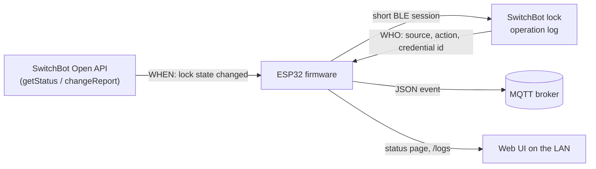

# sentry — SwitchBot Lock Log Reader (ESP32)

ESP32 firmware that reports **who** locked or unlocked a SwitchBot lock
(fingerprint, keypad code, app or manual) by reading the lock's own operation
log over BLE and republishing it over MQTT and HTTP.

The SwitchBot cloud tells you *when* the lock changed (`lockState`/`doorState`),
but never *who*. That identity exists only in the lock's local log, which is
reachable over BLE. So:

> **Cloud says WHEN → firmware fetches WHO over BLE → publishes the merged event.**

It is non-invasive: the keypad still drives the real lock, the hub is untouched,
and the firmware only *reads* a log the lock already keeps.

> [!IMPORTANT]
> This is an unofficial, community project. It is not affiliated with,
> endorsed by, or supported by SwitchBot / Wonderlabs. Use it at your own risk,
> and only with a lock you own.

## Contents

- [Features](#features)
- [How it works](#how-it-works)
- [Trigger modes](#trigger-modes)
- [Hardware and requirements](#hardware-and-requirements)
- [One-time: the lock's communication key](#one-time-the-locks-communication-key)
- [Build and flash](#build-and-flash)
- [First run: provisioning](#first-run-provisioning)
- [Configuration reference](#configuration-reference)
- [Running](#running)
- [Reset](#reset)
- [Security notes](#security-notes)
- [Caveats](#caveats)
- [Troubleshooting](#troubleshooting)
- [Project layout](#project-layout)
- [Contributing](#contributing)
- [License](#license)
- [References](#references)

## Features

- Reads the lock's encrypted operation log over BLE (AES-128-CTR, key from
  your SwitchBot account) and decodes time, source, action and credential id.
- Three trigger modes: SwitchBot Open API polling, Open API webhook, or fully
  offline BLE polling.
- Publishes one JSON message per new log entry to MQTT (plain or TLS), with a
  retained online/offline status topic and Last Will.
- Station-mode web UI behind HTTP digest auth: status page, recent events,
  `/logs` JSON, "Fetch now", reconfigure and factory reset.
- **Learn users** page to map numeric credential ids to names; names are added
  to later events.
- SoftAP captive portal for setup. Nothing is hardcoded; all settings live in
  NVS.
- Remembers the newest published entry across reboots, so events are not
  re-published.
- BOOT button long-press to erase settings.

## How it works



On a trigger, the firmware connects to the lock over BLE only for the duration
of the read, then disconnects so the hub can keep its own link:

1. Scans for the configured lock MAC (5 s active scan; the address is cached
   after the first hit).
2. Requests an IV from the lock using your **Key ID**.
3. Sends an encrypted *set base time* command with the timestamp of the newest
   entry already published (0 on first run).
4. Reads up to 10 entries per fetch until the lock returns an empty row.
5. Publishes each entry newer than the stored timestamp, then stores the new
   newest timestamp in NVS.

For every trigger except `ble-poll` (a cloud state change, a webhook, or
**Fetch now**), if the read fails or returns nothing, the firmware waits 3 s
and retries once, because the lock may not have flushed the entry yet. A
`ble-poll` read is never retried within the same cycle.

## Trigger modes

| Mode | "When" source | Inbound port | Needs hub/account | Notes |
|---|---|---|---|---|
| `cloud-poll` (default) | Open API `getStatus`, polled every N s (default 5) | no | yes | Self-contained; BLE fires only on a `lockState` change |
| `webhook` | Open API `changeReport` POSTed to the device | yes (public URL) | yes | Lowest latency; needs cloudflared or a port forward. Also polls `getStatus` every 60 s as a fallback |
| `ble-poll` | none; reads the BLE log every N s (default 60) | no | no | Works fully offline, at the cost of constant BLE traffic |

In every mode the identity comes from the same BLE log read.

In `cloud-poll` the first status sample after boot is only a baseline; the
next *change* triggers a read. In `webhook` mode the device registers its
public URL with the Open API `setupWebhook` call (`deviceList: "ALL"`) and
retries every 5 minutes until that succeeds.
<!-- TODO: verify whether registering this webhook replaces a webhook URL already used by another integration on the same SwitchBot account -->

## Hardware and requirements

- An ESP32 (classic dual-core recommended: BLE + Wi-Fi + TLS + web server run
  together). The build is documented for **ESP32 Dev Module**.
  <!-- TODO: verify other ESP32 variants (S3, C3, C6); the reset button is hardcoded to GPIO0 -->
- Placed within Bluetooth range of the lock.
- A 2.4 GHz Wi-Fi network.
- A SwitchBot lock plus its **Key ID** and **encryption key** (see below).
- For `cloud-poll` / `webhook`: a SwitchBot Hub paired to the lock, and an Open
  API **token**, **secret** and the lock's **device ID**.
- For `webhook`: a public HTTPS URL that reaches `POST /switchbot-webhook` on
  the device (for example via cloudflared).
- Optional: an MQTT broker.

## One-time: the lock's communication key

```bash
pip install pyswitchbot
python -m switchbot.scripts.get_encryption_key <LOCK_MAC> <account_email>
# prints Key ID (2 hex) and Encryption key (32 hex); enter both in the setup form
```

The login used has no 2FA path: disable 2FA, fetch the key, then re-enable it.
<!-- TODO: verify the 2FA limitation against the current pySwitchbot release -->
Lock log support and the script live in this fork:
<https://github.com/hacker-home-chile/pySwitchbot>

Treat the encryption key as a secret: together with the Key ID and the MAC it
allows encrypted BLE commands to the lock. The Key ID alone is not secret.

## Build and flash

### Arduino IDE 2.x

1. **ESP32 core:** Preferences → Additional Boards Manager URLs →
   `https://espressif.github.io/arduino-esp32/package_esp32_index.json`, then
   Boards Manager → *esp32 by Espressif* (v3.x).
2. **Libraries** (Library Manager): `NimBLE-Arduino` 2.x (h2zero),
   `PubSubClient` (knolleary), `ArduinoJson` 7.x.
3. **Board:** ESP32 Dev Module. **Partition scheme:** a large-app layout
   ("Minimal SPIFFS (Large APPS ~1.9MB)" or "Huge APP"). NimBLE + Wi-Fi + TLS +
   web server will not fit the default.
4. Open `switchbot_log_reader/switchbot_log_reader.ino`, Verify, Upload, then
   open the Serial Monitor at **115200** baud.

### arduino-cli

```bash
arduino-cli core install esp32:esp32
arduino-cli lib install "NimBLE-Arduino" "PubSubClient" "ArduinoJson"
arduino-cli compile -b esp32:esp32:esp32 --build-property build.partitions=min_spiffs \
  --build-property upload.maximum_size=1966080 switchbot_log_reader
arduino-cli upload -b esp32:esp32:esp32 -p /dev/ttyUSB0 switchbot_log_reader
```

Verified against esp32 core 3.3.11, NimBLE-Arduino 2.5.0, ArduinoJson 7.4.3 and
PubSubClient 2.8: the firmware builds warning-free and uses ~1.49 MB (76%) of the
`min_spiffs` app partition and ~62 KB of static RAM.

There are no prebuilt binaries or GitHub releases; build from source.

## First run: provisioning

Nothing is hardcoded. On first boot, whenever the stored config is incomplete,
after **Reconfigure**, or when the device cannot join Wi-Fi within 60 s, it
starts a SoftAP `SB-LogReader-XXXX` (the last two bytes of the chip MAC) and a
captive portal. **The AP password is generated per device and printed on the
serial console**, so watch the Serial Monitor at 115200:

```
[prov] AP   : SB-LogReader-7C4A
[prov] pass : <12-character password>
[prov] open : http://192.168.4.1/
```

Join that network; the captive portal redirects to the setup form (or open
`http://192.168.4.1/`). Save the form and the device stores everything in NVS
and reboots into station mode. The AP password is kept in NVS until a factory
reset, which generates a new one.

### Setup form


Fields follow the selected trigger mode: the Open API, webhook and BLE-poll
sections show and hide as you switch. The password, encryption key, token and
secret fields are masked and never rendered back; once stored, such a field
shows "•••• set - leave blank to keep". Other fields, including the Key ID, are
pre-filled in plain text on a reconfigure.

If you leave **Web UI password** blank and none is stored yet, a random one is
generated and shown once on the confirmation page (and printed to serial). On a
reconfigure, a blank field keeps the stored password. It protects the device
pages on your LAN via HTTP digest auth.

## Configuration reference

All settings are entered in the setup form and stored in NVS (Preferences
namespace `sbcfg`). There are no build-time flags or environment variables.

| Form field | NVS key | Default | Required | Description |
|---|---|---|---|---|
| Wi-Fi SSID | `ssid` | — | yes | 2.4 GHz network to join (max 32 chars) |
| Wi-Fi password | `pass` | — | no | Blank keeps the stored value |
| Lock MAC | `mac` | — | yes | `AA:BB:CC:DD:EE:FF`, `AABBCCDDEEFF` or dash form; stored upper-case with colons |
| Key ID | `keyid` | `0` | form only | 2 hex characters. Required by the form, but the server does not check it: a blank value keeps the stored value, which defaults to `00` |
| Encryption key | `enckey` | — | yes | 32 hex characters (16 bytes) |
| Trigger mode | `mode` | `cloud-poll` | yes | `cloud-poll`, `webhook` or `ble-poll` |
| Open API token | `token` | — | cloud modes | SwitchBot Open API token |
| Open API secret | `secret` | — | cloud modes | Used for the v1.1 HMAC-SHA256 request signature |
| Device ID | `devid` | — | cloud modes | Open API device ID of the lock |
| Poll interval (s) | `poll` | `5` | no | 1–3600; `cloud-poll` only |
| Public URL | `purl` | — | `webhook` | Public URL that reaches `POST /switchbot-webhook` |
| BLE poll interval (s) | `blepoll` | `60` | no | 10–3600; `ble-poll` only |
| Web UI username | `uiuser` | `admin` | no | Max 24 chars |
| Web UI password | `uipass` | generated | no | Max 32 chars; a 10-character one is generated only if the field is blank and none is stored yet |
| MQTT host | `mhost` | — | no | Leave blank to disable MQTT |
| MQTT port | `mport` | `1883` | no | Ticking **Use TLS** switches 1883 ↔ 8883 |
| MQTT username / password | `muser` / `mpass` | — | no | Sent only when set |
| MQTT topic | `mtopic` | `switchbot/lock/log` | no | Event topic; status goes to `<topic>/status` |
| Use TLS | `mtls` | off | no | TLS against the ESP-IDF root CA bundle |

Internal keys in the same namespace: `appass` (SoftAP password), `provreq`
(reconfigure flag) and `lastts` (timestamp of the newest published entry).
Named users are stored separately (namespace `sbusers`).

The form also accepts a JSON body with the same field names (`wifi_ssid`,
`wifi_pass`, `lock_mac`, `key_id`, `enc_key`, `trigger_mode`, `api_token`,
`api_secret`, `device_id`, `poll_interval_s`, `public_url`,
`ble_poll_interval_s`, `ui_user`, `ui_pass`, `mqtt_host`, `mqtt_port`,
`mqtt_user`, `mqtt_pass`, `mqtt_topic`, `mqtt_tls`) posted to
`http://192.168.4.1/save`.

## Running

After boot, the serial console prints the station IP and the web UI URL
(`[boot] mode=... ui=http://<ip>/`). The clock is synced over NTP
(`pool.ntp.org`, `time.nist.gov`); the cloud modes need it for TLS and request
signing. All times in the UI are UTC.

### Status page


`GET /` shows mode, Wi-Fi, lock MAC, lock/door state, cloud and MQTT status,
the last BLE fetch (and its error, if any), the newest entry, uptime and free
heap, plus the most recent events and the Fetch now / Learn users / Reconfigure /
Factory reset actions. `GET /logs` returns the same events as a JSON array.
Recent events are kept in RAM (last 20) and are cleared on reboot.

### Learn users


The lock reports a **numeric credential id**, not a name and not a face image.
Unlock with one known credential, find the row on the Learn users page, and name
it. Later events carry the name in MQTT and in the UI. Names are keyed by
(source, value), since the same number can mean different things for a keypad
code and an app user. Up to 32 names are stored (max 24 characters each);
saving an empty name removes the mapping. Raw fields are always published, so a
mapping stays possible.

### MQTT

One JSON message per new log entry, published to `mqtt_topic` (default
`switchbot/lock/log`) at QoS 0, not retained:

```json
{"ts":1787345561,"index":12,"source":1,"source_name":"keypad","action":1,
 "action_name":"unlock","value":3,"payload":"0100a2","user":"Dana"}
```

| Field | Meaning |
|---|---|
| `ts` | Unix timestamp of the entry, from the lock |
| `index` | Per-entry counter reported by the lock |
| `source` / `source_name` | `0` app, `1` keypad, `2` manual; anything else is `unknown` |
| `action` / `action_name` | `0` lock, `1` unlock, `2` jam; anything else is `unknown` |
| `value` | Credential id (the "who") |
| `payload` | Remaining log bytes, hex |
| `user` | Name from the Learn users table, or `null` when unnamed |

Connection details:

- Client ID `sb-logreader-<chip MAC in hex>`, stable across reboots.
- `<topic>/status` is published retained as `1` on connect; the Last Will
  (retained, QoS 1) is `0`.
- Keep-alive 45 s; reconnect backoff from 1 s doubling to 20 s.
- Plain (1883) and TLS (8883) are both supported. TLS validates against the
  ESP-IDF root CA bundle, so a broker with a private CA needs a publicly trusted
  certificate or a plain-text port.

There is no Home Assistant MQTT discovery; subscribe to the topic directly.

### HTTP endpoints

The web server listens on port 80.

| Endpoint | Auth | Purpose |
|---|---|---|
| `GET /` | digest | Status page |
| `GET /logs` | digest | Recent events as JSON |
| `GET /users` | digest | Learn users page |
| `POST /users/set` (`source`, `value`, `name`) | digest | Name a credential id |
| `POST /users/delete` (`source`, `value`) | digest | Remove a name |
| `POST /fetch-now` | digest | Force a BLE log read |
| `POST /reconfigure` | digest | Reboot into the setup portal, keeping settings |
| `POST /factory-reset` | digest | Erase settings and reboot into setup |
| `POST /switchbot-webhook` | none | SwitchBot `changeReport` sink. Registered in every trigger mode; a matching POST triggers a BLE fetch in any mode |

The webhook route is intentionally unauthenticated (the SwitchBot cloud cannot
authenticate). It ignores anything that is not a `changeReport` for the
configured lock's `deviceMac`.

## Reset

- Hold **BOOT/GPIO0 for ~5 s** (at boot or while running, including in setup
  mode): settings are erased and the device reboots into provisioning.
- `POST /factory-reset` from the web UI does the same.
- **Reconfigure** reboots into the portal with the current settings kept; blank
  secret fields keep their stored values. The device keeps booting into the
  portal, even after a power cycle, until the form is saved.

A reset erases the `sbcfg` namespace: Wi-Fi, lock, cloud, MQTT and web UI
settings, the SoftAP password (a new one is generated) and the last-seen
timestamp. The Learn users names (`sbusers`) are **not** erased.

> [!WARNING]
> After a reset, the next fetch starts from base time 0, so old log entries
> are re-published over MQTT, up to 10 per fetch.

## Security notes

- **Web UI:** protected by HTTP digest auth, but served over plain HTTP on your
  LAN. Use a strong password and keep the device on a trusted network. Do not
  expose it to the internet except for the webhook path.
- **Webhook:** `POST /switchbot-webhook` has no authentication and is always
  live, in every trigger mode, not only in `webhook` mode. Anyone who can reach
  the device can use it to trigger BLE fetches. If you publish it through a
  tunnel, publish only that path.
- **Credentials at rest:** all settings, including the Wi-Fi password, the lock
  encryption key, the Open API token/secret, the MQTT password and the web UI
  password, are stored in NVS **in plain text**. Anyone with physical access
  and a flash reader can recover them, and the encryption key allows BLE
  commands to the lock. Keep the device physically secure.
- **Serial console:** the SoftAP password and any generated web UI password are
  printed at 115200 baud. Anyone with USB access can read them.
- **Physical access:** holding BOOT for 5 s erases the settings and opens the
  setup portal.
- **MQTT:** without TLS, events and broker credentials travel in clear text.
  Enable TLS when the broker is not on a trusted network.
- **Setup portal:** WPA2-protected by the per-device AP password; the form
  itself has no further login.

## Caveats

- Identity is a numeric id you map yourself; there is **no face image**.
- BLE range is required. `ble-poll` adds latency; the cloud modes fetch on demand.
- **Hub contention:** the hub may be holding the lock's BLE link. The firmware
  connects briefly; event-triggered fetches (cloud change, webhook, Fetch now)
  retry once after 3 s, while `ble-poll` never retries within a cycle.
  Lengthen the intervals if connects fail often.
- Re-pairing or resetting the lock rotates the encryption key; fetch it again.
- Log parsing beyond `source`/`action`/`value` is best effort: only the values
  listed above are named, everything else is reported raw.
- A fetch reads at most 10 entries; any remainder comes in on the next fetch.

## Troubleshooting

| Symptom (status page / serial) | Likely cause |
|---|---|
| Device keeps coming back to the `SB-LogReader-XXXX` AP | Config incomplete; Wi-Fi join failed within 60 s (re-enter the Wi-Fi details); or a Reconfigure is pending, which persists across power cycles until the form is saved |
| `lock AA:BB:... not found in scan` | Out of BLE range or wrong MAC |
| `BLE connect failed (hub may hold the link)` | Hub contention; lengthen the poll interval |
| `bad IV response (wrong key id?)` | Wrong Key ID |
| `set-base-time rejected ... check the encryption key` | Wrong or rotated encryption key |
| `cannot sign request (clock not synced?)` | NTP not reachable yet |
| `getStatus HTTP ...` / `statusCode ...` | Wrong token, secret or device ID, or an Open API error |
| MQTT `connect failed (state N)` | Broker host/port/credentials, or TLS against a private CA |

## Project layout

```
switchbot_log_reader/
├── switchbot_log_reader.ino  # setup/loop, mode scheduler, event pipeline
├── config.{h,cpp}            # Config struct, NVS load/save, hex/MAC helpers
├── provisioning.{h,cpp}      # SoftAP + captive portal + setup form
├── sb_proto.{h,cpp}          # BLE byte protocol + AES-128-CTR (mbedTLS)
├── sb_lock_client.{h,cpp}    # NimBLE central: scan, handshake, log loop
├── cloud.{h,cpp}             # Open API v1.1: HMAC signing, getStatus, setupWebhook
├── mqtt.{h,cpp}              # PubSubClient wrapper, backoff, LWT
├── webui.{h,cpp}             # Station web UI, /logs, webhook sink, Learn users
└── users.{h,cpp}             # credential id → name table in NVS
```

## Contributing

Issues and pull requests are welcome. Keep changes focused, build with the
toolchain listed above, and test against a real lock before submitting.
Never include your lock MAC, keys, tokens or Wi-Fi details in issues or logs.

## License

Licensed under the [Apache License 2.0](LICENSE).

## References

- SwitchBot Open API: <https://github.com/OpenWonderLabs/SwitchBotAPI>
- pySwitchbot fork with lock logs: <https://github.com/hacker-home-chile/pySwitchbot>
- Home Assistant integration (prior art for id → name mapping):
  <https://github.com/hacker-home-chile/ha-switchbot-lock-logs>
- NimBLE-Arduino: <https://github.com/h2zero/NimBLE-Arduino>
