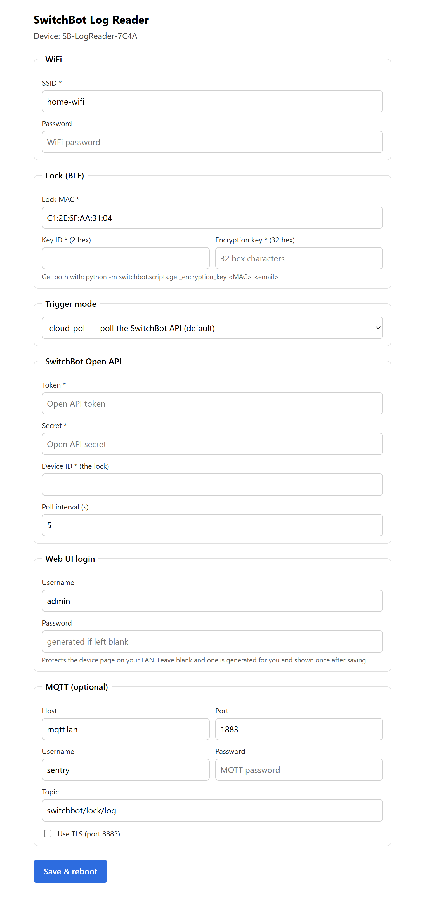
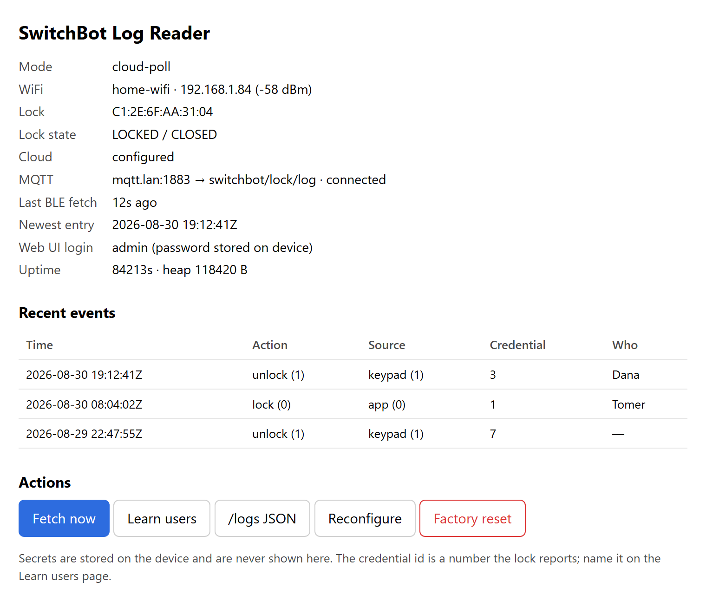
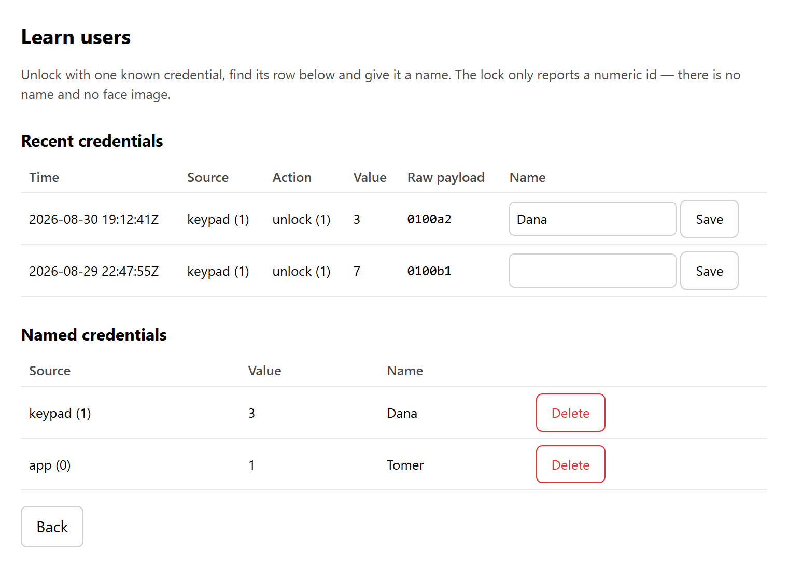

# sentry — SwitchBot Lock Log Reader (ESP32)

ESP32 firmware that reports **who** locked or unlocked a SwitchBot lock —
fingerprint, keypad code, app or manual — by reading the lock's own operation
log over BLE and republishing it over MQTT and HTTP.

The SwitchBot cloud tells you *when* the lock changed (`lockState`/`doorState`);
it never tells you *who*. That identity exists only in the lock's local log,
which is reachable over BLE. So:

> **Cloud says WHEN → firmware fetches WHO over BLE → publishes the merged event.**

It is non-invasive: the keypad still drives the real lock, the hub is untouched,
and the firmware only *reads* a log the lock already keeps.

## Trigger modes

| Mode | "When" source | Inbound port | Needs hub/account | Notes |
|---|---|---|---|---|
| `cloud-poll` (default) | Open API `getStatus`, polled every N s | no | yes | Self-contained; BLE fires only on a state change |
| `webhook` | Open API `changeReport` POSTed to the device | yes (public URL) | yes | Lowest latency; needs cloudflared or a port-forward |
| `ble-poll` | none — polls the BLE log every N s | no | no | Works fully offline, at the cost of constant BLE |

In every mode the identity comes from the same BLE log read.

## Hardware

- ESP32 (classic dual-core recommended — BLE + WiFi + TLS + web server).
- Within Bluetooth range of the lock.
- A SwitchBot Hub paired to the lock (for `cloud-poll` / `webhook`).

## One-time: the lock's communication key

```bash
pip install pyswitchbot
python -m switchbot.scripts.get_encryption_key <LOCK_MAC> <account_email>
# prints Key ID (2 hex) and Encryption key (32 hex) — enter both in the setup form
```

The login used has no 2FA path: disable 2FA, fetch the key, re-enable it. Lock
log support and the script live in this fork:
<https://github.com/hacker-home-chile/pySwitchbot>

## Build & flash (Arduino IDE 2.x)

1. **ESP32 core** — Preferences → Additional Boards Manager URLs →
   `https://espressif.github.io/arduino-esp32/package_esp32_index.json`, then
   Boards Manager → *esp32 by Espressif* (v3.x).
2. **Libraries** (Library Manager): `NimBLE-Arduino` 2.x (h2zero), `PubSubClient`
   (knolleary), `ArduinoJson` 7.x.
3. **Board:** ESP32 Dev Module. **Partition scheme:** a large-app layout
   ("Minimal SPIFFS (Large APPS ~1.9MB)" or "Huge APP") — NimBLE + WiFi + TLS +
   web will not fit the default.
4. Open `switchbot_log_reader/switchbot_log_reader.ino`, Verify, Upload, then
   open the Serial Monitor at 115200.

arduino-cli:

```bash
arduino-cli core install esp32:esp32
arduino-cli lib install "NimBLE-Arduino" "PubSubClient" "ArduinoJson"
arduino-cli compile -b esp32:esp32:esp32 --build-property build.partitions=min_spiffs \
  --build-property upload.maximum_size=1966080 switchbot_log_reader
arduino-cli upload -b esp32:esp32:esp32 -p /dev/ttyUSB0 switchbot_log_reader
```

Verified against esp32 core 3.3.11, NimBLE-Arduino 2.5.0, ArduinoJson 7.4.3 and
PubSubClient 2.8: the firmware builds warning-free and uses ~1.49 MB (76%) of the
`min_spiffs` app partition and ~62 KB of static RAM.

## First run — provisioning

Nothing is hardcoded. On first boot (or whenever the stored config is
incomplete) the device starts a SoftAP `SB-LogReader-XXXX` and a captive portal.
**The AP password is generated per device and printed on the serial console** —
watch the Serial Monitor at 115200:

```
[prov] AP   : SB-LogReader-7C4A
[prov] pass : k7m4pq2rhtwn
[prov] open : http://192.168.4.1/
```

Join that network, fill in the form, and the device saves to NVS and reboots
into station mode.

### Setup form



Fields follow the selected trigger mode — the Open API, webhook and BLE-poll
sections show and hide as you switch. Secrets are never rendered back: once
stored, a field shows "•••• set — leave blank to keep".

If you leave **Web UI password** blank, a random one is generated and shown
once on the confirmation page (and printed to serial). It protects the device
page on your LAN via HTTP digest auth.

## Running

### Status page



`GET /` shows mode, WiFi, lock state, MQTT status, the last BLE fetch and the
most recent events, plus Fetch now / Reconfigure / Factory reset. `GET /logs`
returns the same events as JSON.

### Learn users



The lock reports a **numeric credential id**, not a name and not a face image.
Unlock with one known credential, find the row on the Learn users page, and name
it — later events carry the name in MQTT and in the UI. Raw fields are always
published so a mapping stays possible.

### MQTT

One JSON message per new entry, to `mqtt_topic` (default
`switchbot/lock/log`):

```json
{"ts":1787345561,"index":12,"source":1,"source_name":"keypad","action":1,
 "action_name":"unlock","value":3,"payload":"0100a2","user":"Dana"}
```

Plain (1883) and TLS (8883) are both supported; TLS validates against the
ESP-IDF root CA bundle, so a broker with a private CA needs a publicly trusted
certificate or a plain-text port. A retained `<topic>/status` is published as
`1` on connect with an LWT of `0`.

### HTTP endpoints

| Endpoint | Auth | Purpose |
|---|---|---|
| `GET /` | digest | Status page |
| `GET /logs` | digest | Recent events as JSON |
| `GET /users`, `POST /users/set`, `POST /users/delete` | digest | Credential id → name |
| `POST /fetch-now` | digest | Force a BLE log read |
| `POST /reconfigure` | digest | Reboot into the setup portal, keeping settings |
| `POST /factory-reset` | digest | Erase settings and reboot into setup |
| `POST /switchbot-webhook` | none | SwitchBot `changeReport` sink (webhook mode) |

The webhook route is intentionally unauthenticated — the SwitchBot cloud cannot
authenticate — and ignores anything whose `deviceMac` is not the configured lock.

## Reset

- Hold **BOOT/GPIO0 for ~5 s** (at boot or while running) → settings erased,
  device reboots into provisioning.
- `POST /factory-reset` from the web UI does the same.

## Caveats

- Identity is a numeric id you map yourself; there is **no face image**.
- BLE range is required. `ble-poll` adds latency; the cloud modes fetch on demand.
- **Hub contention:** the hub may be holding the lock's BLE link. The firmware
  connects briefly and retries; lengthen the intervals if connects fail often.
- Re-pairing or resetting the lock rotates the encryption key — fetch it again.
- Configuration (including the Open API secret and MQTT password) is stored in
  NVS in plain text; anyone with physical access and a flash reader can recover it.
- Log parsing beyond `source`/`action`/`value` is best effort: only the values
  documented in the protocol spec are named, everything else is reported raw.

## Layout

```
switchbot_log_reader/
├── switchbot_log_reader.ino  # setup/loop, mode scheduler, event pipeline
├── config.{h,cpp}            # Config struct, NVS load/save, hex/MAC helpers
├── provisioning.{h,cpp}      # SoftAP + captive portal + setup form
├── sb_proto.{h,cpp}          # BLE byte protocol + AES-128-CTR (mbedTLS)
├── sb_lock_client.{h,cpp}    # NimBLE central: scan, handshake, log loop
├── cloud.{h,cpp}             # Open API v1.1: HMAC signing, getStatus, setupWebhook
├── mqtt.{h,cpp}              # PubSubClient wrapper, backoff, LWT
├── webui.{h,cpp}             # Station web UI, /logs, webhook sink, Learn users
└── users.{h,cpp}             # credential id → name table in NVS
```

## References

- SwitchBot Open API: <https://github.com/OpenWonderLabs/SwitchBotAPI>
- pySwitchbot fork with lock logs: <https://github.com/hacker-home-chile/pySwitchbot>
- Home Assistant integration (prior art for id → name mapping):
  <https://github.com/hacker-home-chile/ha-switchbot-lock-logs>
- NimBLE-Arduino: <https://github.com/h2zero/NimBLE-Arduino>
